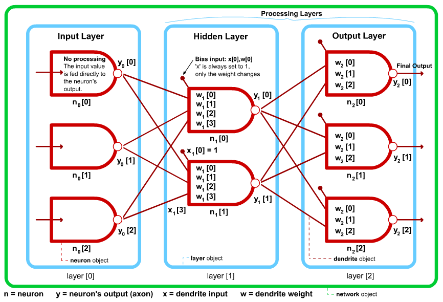

Neural Networks
===============

Please refer to the sites below for an introduction into Artificial Neural Networks (ANNs) and their uses:

[www.ai-junkie.com](http://www.ai-junkie.com/)
[www.doc.ic.ac.uk (Imperial College report)](http://www.doc.ic.ac.uk/%7End/surprise_96/journal/vol4/cs11/report.html)

This project contains C++ classes for creating a Multi-Layer Perceptron Network. I have implemented these classes in an example Win32 Console application (compiled using Visual Studio 2012). You are free to use this code under a [MIT License](LICENSE).

Below is a diagram which illustrates an example Perceptron Network that can be configured using my classes. 

The main source files are as follows:

 * [perceptron.h](perceptron.h) - MLP Net class declarations
 * [perceptron.cpp](perceptron.cpp) - class definitions
 * [testpercept.cpp](testpercept.cpp) - test program using the MLP Net classes
 
Multi-Layer Perceptron networks are probably the best know and most widely used of all Artificial Neural Networks. They are often used to tackle problems such as hand-writing or voice recognition. An MLP net is constructed by arranging perceptron units together in a series of 'layers'. The neurons in each layer are connected to the neurons in the adjacent layers in a hierarchical fashion (the neurons outputs from one layer supply the inputs for the next). Typically, each neuron within a layer will have an input 'dendrite' connected to the output of every neuron in the previous layer (this is known as a FULLY-CONNECTED network, which is the method employed in my classes). The bottom layer is known as an 'input layer' and usually receives input data from sensors or some other input device(s). Further documentation of my perceptron classes can be found here: [neural.pdf](neural.pdf).
